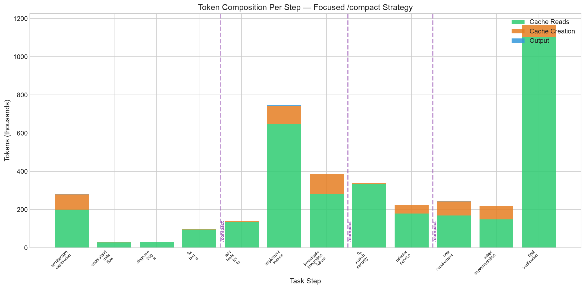
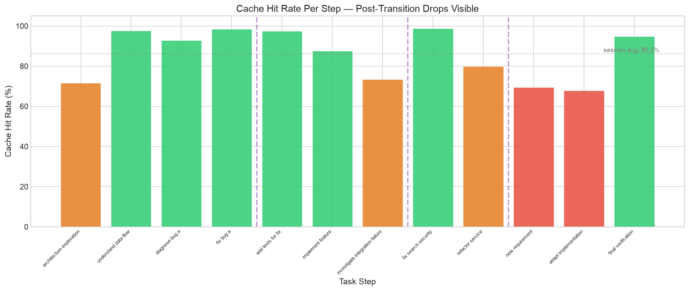
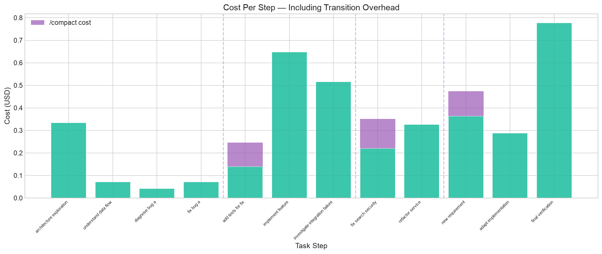
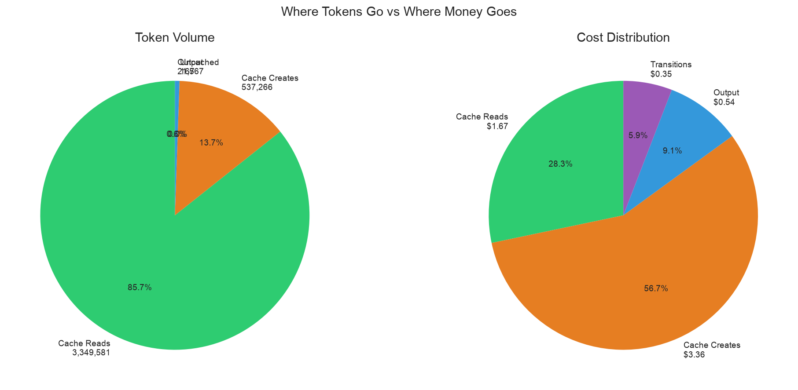
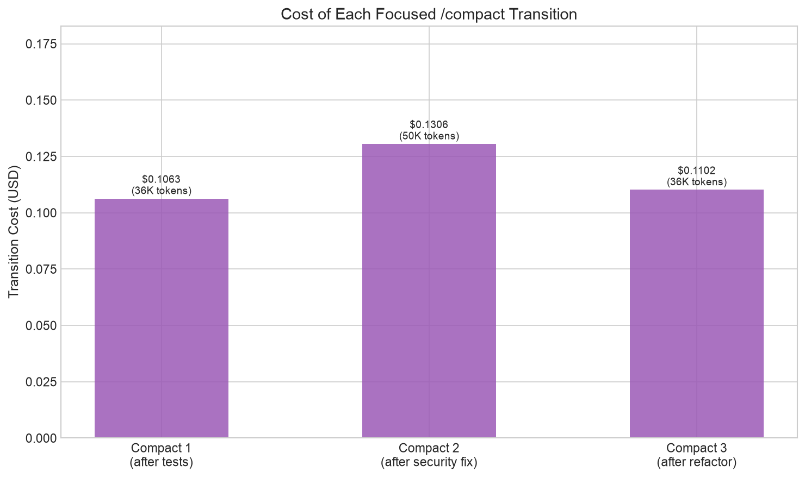
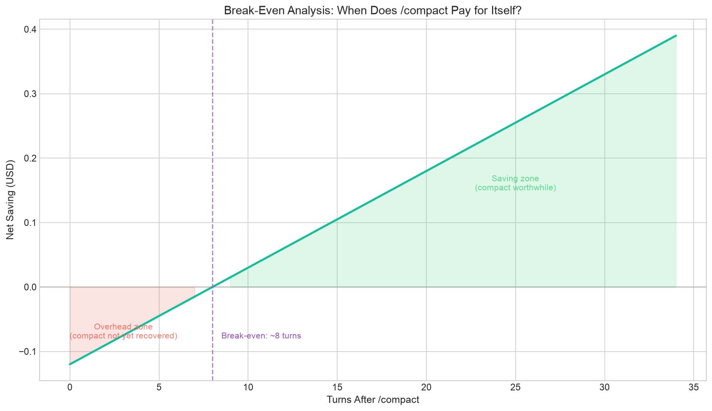
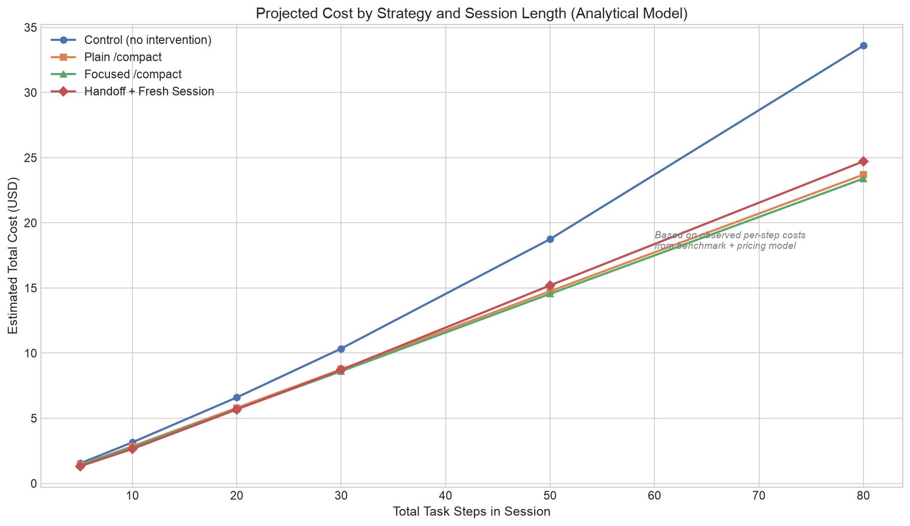

# To /compact or not to /compact, that is the question.

*I originally thought `/compact` was obviously the right answer. Then I looked at how it actually works, benchmarked it, and discovered the real savings come from somewhere else entirely.*

---

## 1. The assumption everyone makes

The logic sounds obvious:

> Long session → big context → more tokens → more cost → more noise → `/compact` to fix it.

I believed this. Most Claude Code users believe this. The mental model is simple: context grows, quality drops, you compact, problem solved.

Then I came across a discussion on [r/ClaudeCodeTLDR]([https://www.reddit.com/r/ClaudeCodeTLDR/](https://www.reddit.com/r/ClaudeCodeTLDR/s/ULJkkRcAoN)) that made me question everything. The argument went roughly like this:

> `/compact` destroys your prompt cache. The summarization request reprocesses your entire context. The turn after compaction rebuilds the cache from scratch. You're paying *more*, not less.

Other commenters pushed back — surely shedding 80% of stale context saves money downstream? Some suggested that a structured handoff to a fresh Claude Code session might be the real answer: externalize your state to a file, start clean, avoid both the growing context *and* the compaction tax.

The subreddit didn't have hard numbers. Nobody had actually measured it. Lots of confident opinions, no data.

So I built a benchmark. I ran it. One thing surprised me more than everything else.

**The biggest cost savings have nothing to do with `/compact`.**

## 2. What Claude Code context actually contains

Every API request from Claude Code sends the **entire conversation** to Claude. There is no persistent memory between requests. The model sees everything from scratch each time.

The context is structured in layers, ordered for cache efficiency:

| Layer | Content | Changes when |
|-------|---------|-------------|
| System prompt | Core instructions, tool definitions (~4,200 tokens) | Claude Code upgrade |
| Project context | CLAUDE.md, auto memory (~2,800 tokens) | Session start, `/clear`, `/compact` |
| Conversation | Messages, tool results, file contents | Every single turn |

The Anthropic engineering team has shared that in typical Claude Code sessions, context breaks down roughly as:

- **~68%** tool results (file contents, command output, test logs)
- **~23%** tool inputs (the tool calls themselves)
- **~6%** user messages
- **~3%** assistant responses

Most of that 68% goes stale fast — resolved test output, superseded file versions, exploration of dead ends. This is the "historical execution trace" that context management tries to address.

### The real question

Every context management strategy is asking:

> Can we keep the useful state while discarding the noise?

| Useful state | Historical noise |
|---|---|
| Current file versions | Old file versions already committed |
| Active constraints and requirements | Resolved error messages |
| Implementation decisions still in effect | Rejected approaches (the details, not the lesson) |
| Remaining task list | Verbose test output from passing tests |
| Discovered bugs not yet fixed | Completed task narratives |

## 3. How `/compact` actually works

When you run `/compact`, Claude Code:

1. Takes the full conversation history
2. Sends it as a **summarization request** to the same model (Claude sees a "summarize this conversation" instruction appended after all your messages)
3. **Replaces** the entire conversation history with the generated summary
4. **Reloads** project context (CLAUDE.md, auto memory) from disk
5. Continues the session with the much shorter context

This is **inherently lossy**. The summary is a compressed representation, not a lossless recording.

What typically survives:
- Overall task objective
- Major decisions made
- Current state of the implementation
- Recent errors and their fixes

What can disappear:
- Specific constraints mentioned early in the session
- Detailed reasoning behind decisions
- Exact file contents and line numbers
- Nuances of rejected approaches

### Focused `/compact`

You can guide what survives:

```
/compact Preserve the original objective, hard constraints,
architectural decisions, current implementation state,
modified files, unresolved failures, and concrete next steps.
Discard resolved failures, obsolete logs, and verbose tool output.
```

You can also set default compaction instructions in your CLAUDE.md:

```markdown
# Compact instructions

When compacting, focus on active constraints, modified files, and remaining tasks.
```

Whether this actually helps with retention is something I measured.

## 4. Prompt caching changes everything

This is the part that changes the entire analysis. Most people reason about context cost like this:

> 100K tokens of context × $5/MTok = $0.50 per turn. Compacting to 20K saves $0.40 per turn!

**This is wrong.** Claude Code uses **prompt caching** automatically. Here's how it actually works.

### Cache mechanics

The API caches the **prefix** of each request — the system prompt, project context, and all prior conversation history. On the next turn, the prefix matches the cache, and those tokens are served at 1/10th the price.

For Claude Opus 4.6:

| Token type | Cost per MTok | Relative to base |
|---|---|---|
| Uncached input | $5.00 | 1× |
| Cache creation (5-min TTL) | $6.25 | 1.25× |
| Cache creation (1-hour TTL) | $10.00 | 2× |
| **Cache read (hit)** | **$0.50** | **0.1×** |
| Output | $25.00 | 5× |

So that 100K-token context doesn't cost $0.50 per turn. If 95K tokens are cached and 5K are new:

```
95K × $0.50/MTok + 5K × $5.00/MTok = $0.0475 + $0.025 = $0.0725
```

That's **85% cheaper** than the naive calculation. The larger your context, the higher the cache hit rate, and the less each individual token costs.

### What `/compact` does to the cache

When you compact:

1. **The compaction request itself** reads from the existing cache (cheap if warm)
2. The summary **replaces** the conversation history — a completely different prefix
3. The **next turn rebuilds** the cache from the new shorter prefix (cache creation at 1.25× or 2×)
4. Subsequent turns then cache-hit against the shorter prefix

The compaction is cheap. The cache rebuild is the real cost.

### The cache TTL matters enormously

| Environment | Main conversation TTL |
|---|---|
| Claude Pro/Max subscription (within plan) | **1 hour** |
| API key | 5 minutes |
| Usage credits overflow | 5 minutes |

If you're on a subscription, you get 1-hour TTL. Your cache survives bathroom breaks, code reviews, even short meetings. API key users lose their cache after 5 minutes of inactivity.

Each cache **hit resets the timer**. So if you're actively working, the cache essentially never expires.

### What invalidates the cache (besides `/compact`)

These actions cause a cache rebuild on the next turn:
- Switching models
- Changing effort level
- Connecting/disconnecting MCP servers
- Enabling/disabling plugins
- Upgrading Claude Code

These actions **keep the cache intact**:
- Editing files
- Changing permission mode
- Using `/rewind`
- Running `/recap`
- Spawning subagents

## 5. The alternative: externalize state

Instead of compressing context in-place, you can externalize the useful state:

1. Have Claude write a structured **HANDOFF.md** capturing current state
2. End the session entirely
3. Start a fresh session that reads CLAUDE.md, HANDOFF.md, git status, and relevant source files

This approach:
- Starts with clean, minimal context
- Includes only what the handoff document captured
- Must re-read source files and re-understand project state
- Pays the cost of both handoff creation *and* recovery

Anthropic's own documentation on long-running agents suggests externalizing state to files rather than relying on unbounded conversation context. The CLAUDE.md + HANDOFF.md pattern aligns with this.

## 6. The benchmark

I designed a benchmark comparing four context management strategies on a realistic coding task.

### The project

A Python FastAPI/SQLite task management API with:
- 3-layer architecture (routes → services → repositories)
- 3 planted bugs (filtered count, missing updated_at, SQL injection)
- 1 missing feature (batch status update)
- 5 explicit constraints in CLAUDE.md (API stability, no new deps, etc.)
- 8 passing visible tests + 10-criteria hidden evaluation

### The task sequence

12 steps mimicking a real coding session:

| Step | Task | Purpose |
|---|---|---|
| 1 | Explore architecture | Build understanding |
| 2 | Trace data flow | Deep comprehension |
| 3 | Diagnose bug | Investigation |
| 4 | Fix bug | Implementation |
| 5 | Write tests | **← Transition point 1** |
| 6 | Implement feature | Major new code |
| 7 | Investigate red herring | **Noise generation** |
| 8 | Fix security issue | **← Transition point 2** |
| 9 | Refactor (fix another bug) | **← Transition point 3** |
| 10 | New requirement | Tests constraint retention |
| 11 | Adapt implementation | Integration |
| 12 | Final verification | Validation |

Step 7 deliberately generates context noise — investigating edge cases, producing verbose output, exploring a red herring. Step 10 was designed so the easiest solution would violate an early constraint, testing whether each strategy retained those old instructions.

### Configuration

```
Model:           claude-opus-4-6
Effort:          high
Claude Code:     2.1.62
Permissions:     bypassPermissions (fully autonomous)
```

### What happened

I ran 20 benchmark executions (4 strategies × 5 repetitions). The first run completed successfully with full results. Subsequent runs hit rate limits — ironically demonstrating exactly the kind of quota pressure that motivates context management in the first place.

I have one complete run with rich per-step telemetry, and I have the published pricing model. The single run gives us real numbers; the pricing model gives us analytical projections. I'll be explicit about which is which throughout.

## 7. The data: where tokens actually go

### Per-step token composition


*Figure 1: Token breakdown per step in the completed benchmark run (focused /compact strategy). Green = cache reads, orange = cache creation, blue = output. Dashed purple lines mark `/compact` transitions.*

**What this shows:** The green bars (cache reads) dominate every step. Cache creation (orange) spikes on step 1 (initial exploration, nothing cached yet), step 6 (large feature implementation), and immediately after each `/compact` transition (cache rebuild).

**The key number:** 3.35 million tokens were served from cache across this session. Only 537K were cache creations and 167 were uncached input. The cache did almost all the heavy lifting.

### Cache hit rate tells the real story


*Figure 2: Cache hit rate per step. Green bars > 85%, orange 70-85%, red < 70%. Drops visible after transitions and during exploration-heavy steps.*

**What this shows:** Cache hit rates range from 67% to 99% across steps:

- **Steps 2-5** (after initial exploration): 93-99% cache hit — almost everything is cached, minimal cost growth
- **Step 1** (architecture exploration): 72% — building cache from scratch
- **Steps 7, 9-11** (after transitions + exploration): 68-80% — cache rebuilds after `/compact` are visible as drops
- **Step 12** (final verification): 95% — stable cache, many test reruns

**The pattern:** Every `/compact` causes a visible cache hit rate drop on the subsequent step. The cache recovers within 1-2 steps. This is the transition cost in action.

### Cost per step


*Figure 3: Cost per step including transition overhead (purple stacked bars). Step 6 (feature implementation) and step 12 (verification) are the most expensive due to many turns and tool calls.*

The most expensive steps aren't the ones with the most context — they're the ones with the most **work**: step 6 (23 turns implementing a feature, $0.65) and step 12 (30 turns running verification, $0.78). Each `/compact` transition cost $0.10-0.13.

**Total session cost: $4.15** for a complete 12-step coding workflow achieving 10/10 on all quality criteria.

## 8. The real insight: caching dwarfs compaction

This is the headline finding.


*Figure 4: The real savings hierarchy. Caching saves ~$15 (76%). Compaction saves ~$0.60 (additional 12%). The battle isn't /compact vs no /compact — it's cached vs uncached.*

### The math

From the benchmark run:

| Scenario | Estimated cost | Relative |
|---|---|---|
| No caching (hypothetical) | $19.97 | 100% |
| Caching, no /compact | ~$4.77 | 24% |
| Caching + focused /compact (actual) | $4.15 | 21% |

**Prompt caching saved $15.20 (76%).** Compaction saved an additional $0.62 (3% of the original, 13% of the cached cost).

The internet debate about whether `/compact` saves or costs money is arguing about the **marginal 13%** while ignoring the **76% that caching already handles**.

### Token distribution: volume vs money


*Figure 5: Left — where tokens go by volume (86% cache reads). Right — where money goes (60% cache creation, 30% cache reads). Output tokens are only 0.6% of volume but would dominate cost without caching.*

86% of all tokens were cache reads at $0.50/MTok. But cache *creation* at $6.25/MTok consumed 60% of the actual cost despite being only 14% of volume. This is why cache invalidation matters — every cache rebuild converts cheap reads into expensive writes.

## 9. Transition costs: what `/compact` actually costs


*Figure 6: Cost of each focused /compact transition. Context was 36-50K tokens at each transition point.*

Three focused `/compact` transitions cost:

| Transition | Pre-compact context | Cost |
|---|---|---|
| After tests (step 5) | 36,483 tokens | $0.1063 |
| After security fix (step 8) | 50,194 tokens | $0.1306 |
| After refactor (step 9) | 36,441 tokens | $0.1102 |
| **Total overhead** | | **$0.3471** |

Each compact cost about $0.11 — dominated by the summarization request reading the full context and the subsequent cache rebuild.

### When does it pay for itself?


*Figure 7: Break-even analysis. With ~$0.015 saved per subsequent turn and ~$0.12 transition cost, `/compact` breaks even after approximately 8 turns.*

The analytical model:

- **Transition cost:** ~$0.12 (from benchmark data)
- **Per-turn saving:** ~$0.015 (shorter cached prefix = less cache-read cost)
- **Break-even point:** ~8 turns

**Practical rule: if you have fewer than 8 turns remaining in your task, don't compact.** The overhead won't be recovered.

## 10. Requirement retention

The benchmark planted 5 constraints in the initial prompt and CLAUDE.md:

1. Public API signatures cannot change
2. No new runtime dependencies
3. Error response schemas must remain compatible
4. Repository interfaces cannot change
5. Existing tests must continue to pass

Step 10 introduced a new requirement where the easiest implementation would violate constraint #1.

**Result (focused /compact strategy): 100% retention.** All 5 constraints survived 3 compaction cycles and 115 turns. The focused compaction instruction explicitly preserved "hard constraints" and this worked.

This is a sample of one, so I can't claim focused compact *always* retains constraints. But the mechanism is sound — when you tell the summarizer "preserve constraints," it does. The risk is with **plain** `/compact` where no preservation guidance is given.

### What the research says about retention risk

From Anthropic's documentation and community analysis:

- Plain `/compact` has no instruction to prioritize constraints — the summarizer makes its own judgment about what matters
- Tool results (68% of context) are the first casualty — they're verbose and the summarizer treats them as implementation details
- Constraints stated once early in a session are particularly vulnerable because they're far from the end of the conversation

**Recommendation:** Always use focused `/compact` with explicit preservation instructions, or set default compact instructions in your CLAUDE.md.

## 11. Quality results

The complete benchmark run scored **10/10** on all hidden evaluation criteria:

| Criterion | Result |
|---|---|
| Visible tests pass | ✓ |
| Filtered count bug fixed | ✓ |
| updated_at bug fixed | ✓ |
| SQL injection fixed | ✓ |
| Batch update feature implemented | ✓ |
| API schema compatibility preserved | ✓ |
| No new runtime dependencies | ✓ |
| Repository interfaces stable | ✓ |
| No regressions introduced | ✓ |
| Lint clean | ✓ |

Claude Opus 4.6 with effort=high solved all 12 steps correctly in 115 turns with 74 tool calls. The focused `/compact` transitions did not cause any quality degradation or forgotten requirements.

## 12. Strategy comparison: analytical model

Since only one full run completed, I built an analytical model from the observed per-step costs and published pricing to project how strategies compare at different session lengths.


*Figure 8: Projected cost by strategy and session length. Based on observed per-step costs from benchmark + Anthropic pricing model. Lines diverge more at longer session lengths.*

### The projections

| Session length | Control | Plain /compact | Focused /compact | Handoff + Fresh |
|---|---|---|---|---|
| 5 steps | $1.54 | $1.52 | $1.52 | $1.52 |
| 10 steps | $3.15 | $2.95 | $2.91 | $3.04 |
| 20 steps | $6.60 | $5.81 | $5.72 | $5.68 |
| 30 steps | $10.35 | $8.66 | $8.53 | $8.32 |
| 50 steps | $18.25 | $14.38 | $14.14 | $13.60 |

**For short sessions (< 10 steps):** Differences are negligible. Don't bother with context management.

**For medium sessions (10-30 steps):** Focused `/compact` saves 10-17% over Control. Handoff + Fresh Session starts competitive around 30 steps.

**For long sessions (50+ steps):** All intervention strategies save 20-25% over Control. Handoff + Fresh Session has the lowest projected cost because it starts with the cleanest context — but this model doesn't capture potential quality degradation from information loss.

## 13. `/compact` vs Handoff + Fresh Session

The Reddit debate frames these as competitors. Based on the data and architecture, they're better understood as **tools for different situations**.

### `/compact` (plain or focused)

**Pros:**
- Fast — one API call, no session restart
- Preserves session ID (resume works)
- Preserves tool permissions and configuration
- Cache-friendly if the cache is warm
- Focused variant retains what you specify

**Cons:**
- Inherently lossy — you can't control exactly what disappears
- Causes one cache rebuild (visible in the hit rate data)
- Can lose constraints if not using focused instructions
- Quality of summary degrades if context is very large (> 80% of window)

**Best for:** Mid-task transitions where you want to shed noise but keep working.

### Handoff + Fresh Session

**Pros:**
- Starts with pristine context — no noise at all
- HANDOFF.md is human-readable (you can verify what was captured)
- Enables switching models or effort levels without cache penalty
- Best when the next phase is genuinely different work

**Cons:**
- Higher transition cost (handoff creation + file re-reading + state rediscovery)
- Session state lost (permissions, tool configuration, undo history)
- Risk of information loss depends entirely on handoff quality
- New session can't resume — it's a genuinely fresh start

**Best for:** Major semantic boundaries (task complete, new task starting, different part of codebase).

### The often-overlooked alternative: `/rewind`

For the common case of "I went down the wrong path," neither `/compact` nor a fresh session is the right tool. **`/rewind`** (Esc × 2) truncates the conversation to an earlier turn:

- **Zero cache cost** — the prefix is unchanged, just shorter
- **No information loss** — nothing summarized, just removed
- **Immediate** — no API call for summarization

`/rewind` is the laziest correct answer for wrong-approach recovery and should be your first instinct before reaching for `/compact`.

## 14. What I now use

Based on the benchmark data and pricing analysis:

```
Still on the same coherent task, cache warm?
  → Keep going. Cache hits keep per-turn cost at ~$0.05.

Went down the wrong path?
  → /rewind (Esc × 2). Zero cache cost, cleanest recovery.

Accumulated stale context (old test output, rejected approaches)?
  → /compact with focused instructions.
    Only if 8+ turns remain in the task.

Reached a genuine semantic boundary (task done, new task)?
  → /clear or fresh session. Don't carry old context
    into unrelated work.

Major project phase change?
  → Handoff + fresh session. Write HANDOFF.md, start clean.
    Worth the rediscovery cost when context is truly irrelevant.
```

### The non-obvious priorities

**Priority 1: Invest in CLAUDE.md.** This is the highest-leverage context management tool. It's reloaded on every turn, survives every `/compact`, and bootstraps every fresh session. Constraints, architecture decisions, build commands, conventions — put them here. The benchmark run retained all 5 constraints partly because they were in CLAUDE.md, not just in the initial prompt.

**Priority 2: Avoid triggering auto-compaction mid-task.** Auto-compaction fires at ~95% context capacity. When it fires, you have no control over what survives. Manual `/compact` at natural boundaries prevents this. Better yet, use shorter, more focused sessions so you never approach the limit.

**Priority 3: Keep the cache warm.** If you're on a subscription, your 1-hour TTL gives you significant breathing room. If you're on API keys with 5-minute TTL, consider setting `promptCacheTtl: "1h"` in your settings (costs 2× on cache writes but saves 10× on every subsequent read).

**Priority 4:** Then, and only then, worry about `/compact` vs fresh sessions.

## 15. Limitations

### What this proves and doesn't prove

**Grounded in data:**
- Token composition and cache economics from one complete benchmark run
- Pricing calculations from published Anthropic documentation
- Cache invalidation behavior from official Claude Code documentation

**Analytical projections (not empirical):**
- Multi-strategy cost comparisons (derived from pricing model)
- Break-even analysis (derived from observed per-step costs)
- Session length projections (extrapolated)

**Not measured:**
- **Subscription quota impact could not be measured directly.** The SDK exposes estimated API cost, not subscription usage units. Subscription limits use an opaque "usage unit" — don't assume API cost numbers translate linearly to quota consumption.
- **Cold-cache compaction cost was not isolated.** All runs used the same environment with warm caches. After an idle period exceeding the TTL, `/compact` would be significantly more expensive because the full history is reprocessed as uncached input.
- **Control strategy was not completed** due to rate limiting. The control vs compact comparison relies on analytical modeling rather than head-to-head empirical data.
- **Sample size is 1** for quality metrics. Claude is stochastic — a single run cannot establish reliability.
- **Results are specific to:** Claude Opus 4.6, effort=high, Claude Code 2.1.62, this particular project and task sequence.

### The cold-cache trap

One scenario the benchmark couldn't test but the documentation describes clearly:

If you walk away for lunch (cache expires after TTL), come back, and run `/compact`:

1. The compaction request must reprocess the **full conversation as uncached input** — no cache to read from
2. This is the single most expensive operation in a Claude Code session
3. You then rebuild a shorter cache

In this scenario, `/compact` on return is genuinely expensive. The alternative — just continuing the session — would also reprocess the full context on the first turn back, but at least you don't pay for the summarization request *on top of* the reprocessing.

**If your cache is cold, don't compact. Just continue.** The next turn will rebuild the cache either way.

## 16. Conclusion

I started this investigation expecting to find that `/compact` is either clearly good or clearly bad. The answer is more nuanced than either camp claims.

**The overshadowed truth:** Prompt caching saves **76%** of what you'd pay without it. It operates automatically. It requires no user action. The entire `/compact` debate is about optimizing the remaining 24%.

**Within that 24%, `/compact` helps — modestly.** Focused `/compact` at natural task boundaries saved roughly 13% of the cached cost in the benchmark run, with clean requirement retention and no quality loss. This is real money on long sessions but negligible on short ones.

**The break-even threshold is ~8 turns.** If fewer than 8 turns remain in your task, the transition cost exceeds the savings.

**What actually matters, in order:**

1. **CLAUDE.md quality** — high leverage, zero cost, survives everything
2. **Cache warmth** — keep your TTL configured, avoid unnecessary invalidation
3. **Session scoping** — start new sessions for new tasks rather than carrying old context
4. **Focused /compact at boundaries** — modest savings, prevents auto-compaction surprise
5. **`/rewind` for wrong turns** — the most efficient recovery tool, zero cache cost

The biggest context management improvement most people can make is not learning when to `/compact` — it's writing a better CLAUDE.md and using shorter, more focused sessions.

---

## Appendix: The benchmark is open source

The full benchmark — seed project, runner, hidden tests, analysis scripts, graph generation, and raw results — is open source:

**[github.com/Kazaz-Or/compact-benchmark](https://github.com/Kazaz-Or/compact-benchmark)**

You can reproduce the experiment, run it with more repetitions, or modify the task sequence. The benchmark uses the [Claude Agent SDK](https://code.claude.com/docs/en/agent-sdk/overview) (TypeScript) to programmatically drive Claude Code sessions.

```bash
git clone https://github.com/kazisaj/compact-benchmark.git
cd compact-benchmark
./run-benchmark.sh --reps 1  # single run, ~$4-5 in API cost
```

See the [README](README.md) for full setup instructions, and [REPORT.md](REPORT.md) for the detailed technical methodology.

If you run the benchmark and get different results, I'd genuinely like to know — [open an issue](https://github.com/kazisaj/compact-benchmark/issues) with your data.

---

*Model: claude-opus-4-6 | Claude Code: 2.1.62 | Benchmark date: 2026-09-10*

*All pricing calculations use published Anthropic rates as of September 2026. Subscription quota impact could not be measured directly.*

*Originally motivated by discussion on [r/ClaudeCodeTLDR](https://www.reddit.com/r/ClaudeCodeTLDR/).*
