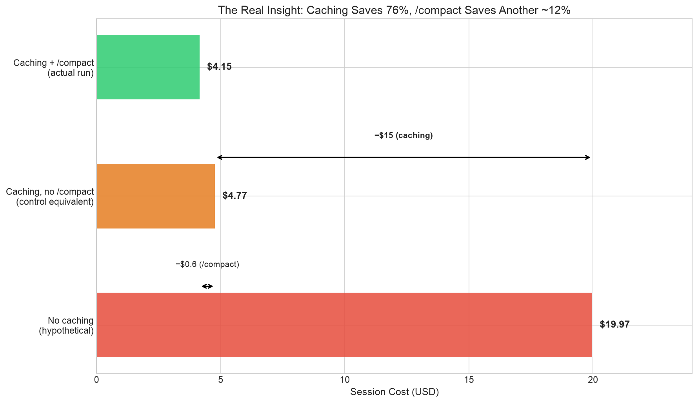

# Claude Code `/compact` Benchmark

> **Does `/compact` actually save money? Or does it cost more by invalidating the prompt cache?**

This repo contains the benchmark, raw data, analysis, and the resulting article:

**[Kazi's dev blog](https://www.kazis.dev/blogs/compact-benchmark)**

## TL;DR of the findings

- **Prompt caching saves 76% automatically** — no user action needed
- `/compact` saves an additional ~13% of the remaining cost — real but modest
- **Break-even: ~8 turns.** Don't compact if fewer than 8 turns remain
- **CLAUDE.md is the highest-leverage context tool** — survives everything, costs nothing
- `/rewind` (Esc×2) is better than `/compact` for wrong-path recovery — zero cache cost



## Background

Motivated by discussion on [r/ClaudeCodeTLDR](https://www.reddit.com/r/ClaudeCodeTLDR/) about whether `/compact` helps or hurts. Nobody had measured it, so I built a benchmark.

## What this benchmarks

Four context management strategies for long Claude Code sessions:

| Strategy | What happens at task boundaries |
|---|---|
| **Control** | Nothing — continue the same session |
| **Plain /compact** | Run `/compact` with no custom instruction |
| **Focused /compact** | Run `/compact` with explicit preservation instructions |
| **Handoff + Fresh Session** | Create HANDOFF.md, end session, start fresh |

Each strategy runs the same 12-step coding workflow on a realistic FastAPI/SQLite project:

1. Explore architecture
2. Trace data flow
3. Diagnose bug (filtered count)
4. Fix bug
5. Write tests ← *transition point*
6. Implement feature (batch status update)
7. Investigate red herring (noise generation)
8. Fix security issue (SQL injection) ← *transition point*
9. Refactor (fix updated_at bug) ← *transition point*
10. New requirement (tests constraint retention)
11. Adapt implementation
12. Final verification

## Quick start

```bash
# Clone
git clone https://github.com/kazisaj/compact-benchmark.git
cd compact-benchmark

# Run (from a normal terminal, NOT inside Claude Code)
./run-benchmark.sh --reps 1    # Single run per strategy (~$4-5 each)
./run-benchmark.sh              # Default: 5 reps × 4 strategies
```

**Cost warning:** Each complete run costs ~$4-5 in API usage (Claude Opus 4.6). The default 20 runs will cost ~$80-100. Start with `--reps 1`.

### Prerequisites

- **Node.js ≥ 20** — benchmark runner uses the Claude Agent SDK (TypeScript)
- **Python ≥ 3.11** — seed project, analysis, and graph generation
- **Claude Code CLI** — authenticated (`claude auth login`)
- Python packages auto-installed: matplotlib, pandas, numpy, fastapi, pytest, httpx, ruff

### Options

```bash
./run-benchmark.sh --reps 3                                   # 3 repetitions
./run-benchmark.sh --reps 1 --strategies control,plain_compact # Subset of strategies
```

## Project structure

```
compact-benchmark/
├── ARTICLE.md                    ← The published blog post
├── REPORT.md                     ← Detailed technical methodology + raw numbers
├── run-benchmark.sh              ← Single entry point (runs everything)
│
├── benchmark/
│   ├── seed_project/             ← Realistic FastAPI/SQLite project
│   │   ├── CLAUDE.md             ← Project constraints (part of the test)
│   │   ├── src/
│   │   │   ├── api/routes.py     ← HTTP endpoints
│   │   │   ├── services/         ← Business logic layer
│   │   │   ├── repositories/     ← Data access layer (3 planted bugs here)
│   │   │   ├── models/schemas.py ← Pydantic schemas (API contract)
│   │   │   └── database.py       ← SQLite connection
│   │   └── tests/                ← Visible test suite (8 tests)
│   │
│   ├── runner/                   ← TypeScript benchmark orchestrator
│   │   ├── src/main.ts           ← Main loop: strategies × reps, randomized
│   │   ├── src/session.ts        ← Claude Agent SDK wrapper
│   │   ├── src/prompts.ts        ← Task prompts (identical across strategies)
│   │   └── src/types.ts          ← Metric type definitions
│   │
│   ├── hidden_tests.py           ← Quality evaluation (10 criteria, not visible to Claude)
│   ├── analyze.py                ← Graph generation (matplotlib)
│   └── generate_article.py       ← Article/report generation from results
│
├── results/                      ← Benchmark output (included)
│   ├── raw/                      ← Per-run JSON with full telemetry
│   ├── benchmark_results.json    ← Aggregate results
│   └── summary.csv               ← Summary table
│
├── graphs/                       ← Generated graphs (PNG + SVG, included)
│   ├── 01_token_composition_per_step.*
│   ├── 02_cache_hit_rate.*
│   ├── 03_cost_per_step.*
│   ├── 04_cumulative_cost.*
│   ├── 05_token_vs_cost_distribution.*
│   ├── 06_transition_cost.*
│   ├── 07_breakeven_analysis.*
│   ├── 08_strategy_comparison_model.*
│   └── 09_caching_dominance.*
│
└── generate_final.py             ← Graph generation from complete run data
```

## What gets measured

### Per step
- Input / output / cache-read / cache-creation tokens
- Cost (USD, SDK estimate)
- Tool calls and turn count
- Wall clock time
- Cache hit rate

### Per transition
- Transition cost (compaction or handoff)
- Pre-compaction token count
- Post-compaction token count

### Final evaluation (hidden tests, 10 criteria)
| Criterion | What it checks |
|---|---|
| Visible tests pass | pytest suite |
| Filtered count fix | Bug: list total didn't match filtered results |
| updated_at fix | Bug: updates didn't touch updated_at |
| SQL injection fix | Bug: f-string interpolation in SQL query |
| Batch update feature | New PATCH endpoint for bulk status changes |
| API schema compat | No breaking changes to Pydantic schemas |
| No new deps | pyproject.toml dependencies unchanged |
| Repo interface stable | Repository method signatures preserved |
| No regressions | Existing functionality still works |
| Lint clean | ruff check passes |

## Configuration

Hardcoded in `benchmark/runner/src/main.ts`:

| Setting | Value |
|---|---|
| Model | `claude-opus-4-6` |
| Effort | `high` |
| Permissions | `bypassPermissions` |
| Transition points | After steps 5, 8, 9 |

To change the model or task sequence, edit `main.ts` and `prompts.ts`.

## Reproducing the results

The `results/` and `graphs/` directories contain the data from the original benchmark run. To regenerate graphs from existing data without re-running the benchmark:

```bash
cd benchmark
python3 ../generate_final.py    # Regenerate graphs from the complete run
```

To re-run the full benchmark from scratch:

```bash
rm -rf results/ work/
./run-benchmark.sh --reps 5
```

## License

MIT — see [LICENSE](LICENSE).

## Acknowledgments

- Prompted by discussion on [r/ClaudeCodeTLDR](https://www.reddit.com/r/ClaudeCodeTLDR/)
- Built with [Claude Agent SDK](https://code.claude.com/docs/en/agent-sdk/overview)
- Pricing data from [Anthropic documentation](https://platform.claude.com/docs/en/about-claude/pricing)
- Cache mechanics from [How Claude Code uses prompt caching](https://code.claude.com/docs/en/prompt-caching)
